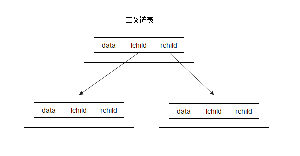
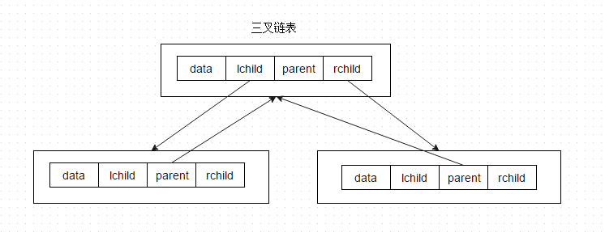
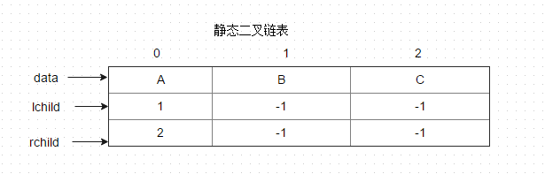
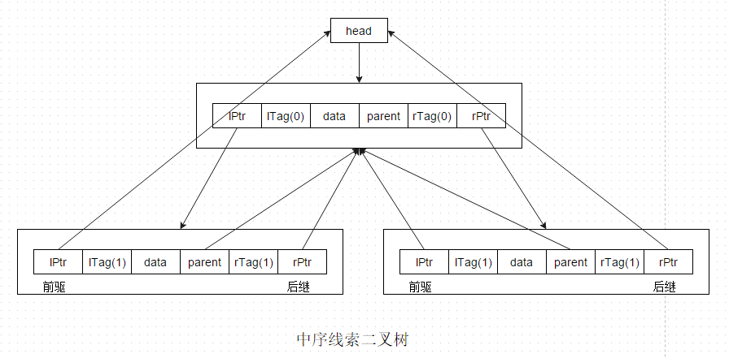
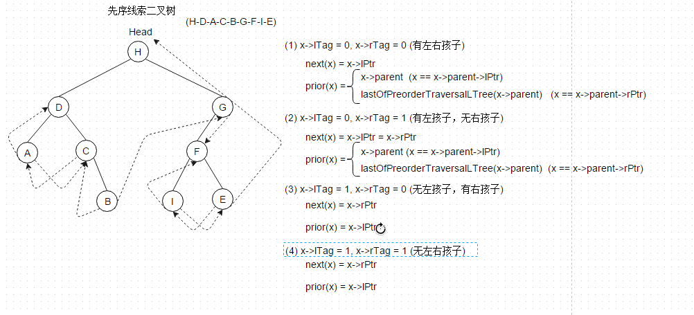
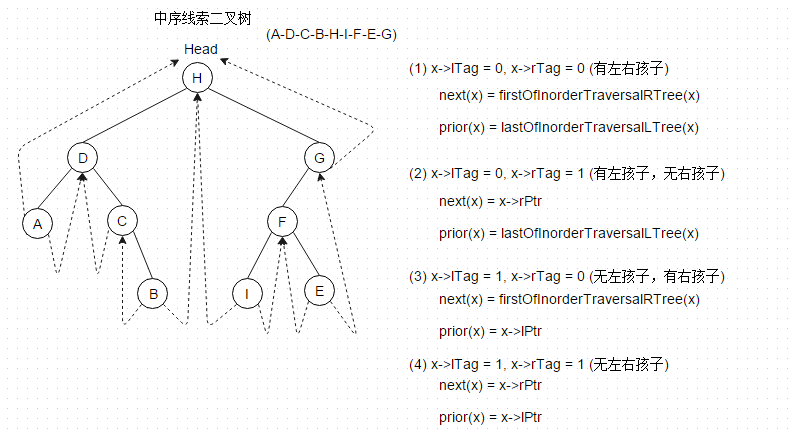
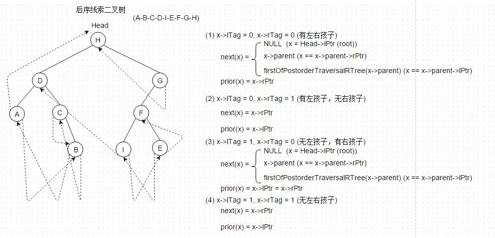
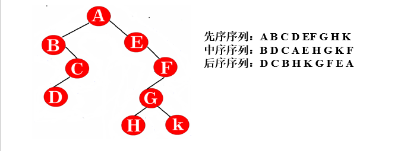

# Binary Tree

二叉树是有序树，每个节点至多有2颗子树，其拥有以下特性：

- 二叉树的第i层上至多有2i-1个节点
- 深度为k的二叉树中，最多具有2k-1个节点
- 如果一棵二叉树中叶子节点个数为n0，且度为2的节点个数为n2，则n0 = n2 + 1
- 具有n个节点的完全二叉树的深度为向下取整(log2n) + 1
- 对于一棵完全二叉树，如果对其节点按层序编号(从1开始编号)，则对于任何节点i，PARENT(i) = 向下取整(i/2) （i不是根节点，即i>1）; 如果2i > n，则该节点无左孩子，否则其LCHALD(i) = 2i; 如果2i + 1 > n，则节点i无右孩子，否则其RCHILD(i) = 2i + 1;

#### 二叉树的存储结构

1. 对于满二叉树或者完全二叉树，可以使用顺序存储结构，理由其特性可以很方便的访问一个节点的PARENT和CHILD
2. 链式存储结构，包括二叉链表和三叉链表，视将要对该二叉树所要进行的操作进行决定

3. 静态二叉链表，使用线性表的形式存储二叉树的信息

4. 线索二叉树，从任何节点出发都能很快的找到其某种遍历序列中的前驱或后继，适用于需要经常遍历或者需要查找结点在遍历中的前驱或后继的情况

**先序线索二叉树：**

**中序线索二叉树：**

**后序线索二叉树：**

#### 遍历二叉树

- **先序遍历：** 根-左-右
- **中序遍历：** 左-根-右
- **后序遍历：** 左-右-根

