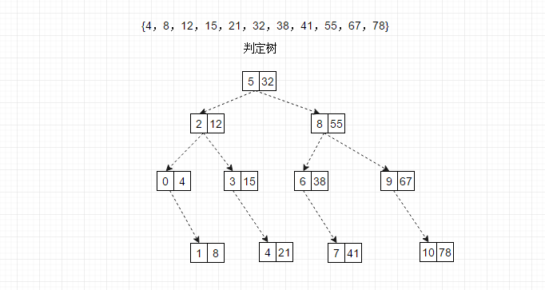
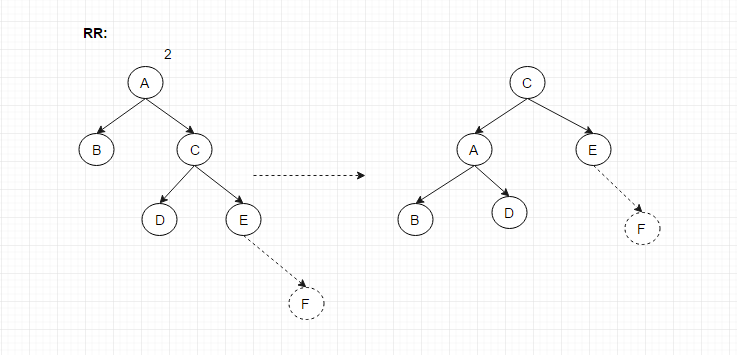
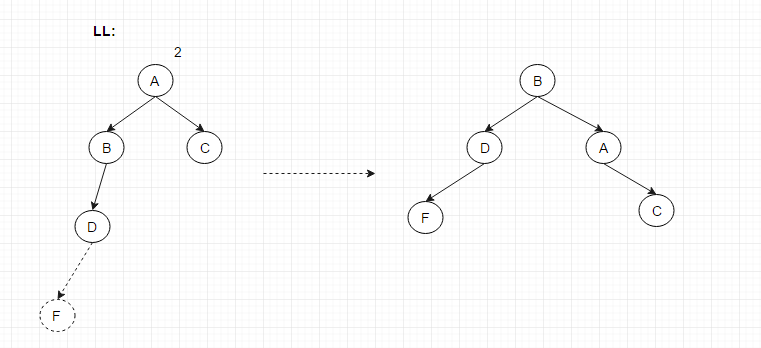
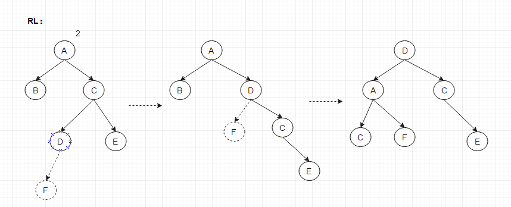
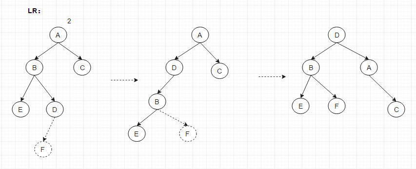

# Search

> 有关查找算法的数据结构。

#### Binary Search

顺序有序表的简单查找，查找过程是对对应的二叉排序树(判定树)的遍历，时间复杂度O(log n)。
```c++
size_t Search_Binary(List L, KeyType key){
	size_t low = 0, hight = L.length() - 1;
	while(low <= hight){
		mid = (low + hight) / 2;
		if (EQ(key, L[mid])) return mid;
		else if(LT(key, L[mid])) hight = mid - 1; // 进入左子树
		else low = mid + 1; // 进入右子树
	}
	return -1;
}
```


#### Nearly Optimal Search Tree

静态你次优查找树，适用于记录(有序)的查找概率不等，构造带权内路径长度近似最小的二叉树.

#### Balanced Binary Tree

平衡二叉树(AVL)，每个节点的平衡因子(左右子树的深度差的绝对值)不超过1。

AVL失衡情况处理：
- 插入右子树根节点的右子树上(RR)，以失去平衡的节点的右孩子为基准，将该节点为根的子树向左旋

- 插入左子树根节点的左子树上(LL)，以失去平衡的节点的左孩子为基准，将该节点为根的子树向右旋

- 插入右子树根节点的左子树中(RL)，对失衡节点的右子树右旋，再将以该节点为根的整棵树左旋

- 插入左子树根节点的右子树上(LR)，对失衡节点的左子树左旋，在将以该节点为根的整棵树右旋
