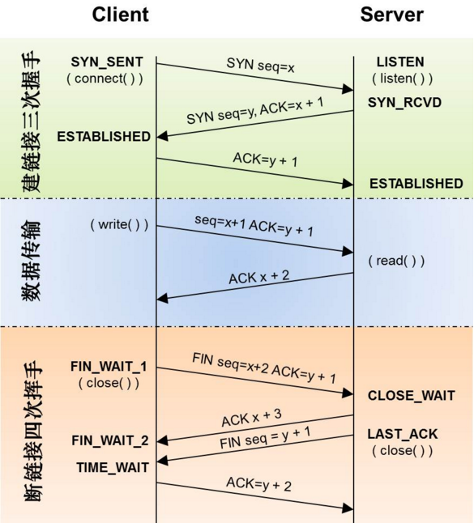

# HTTP

HTTP链接的建立：三次握手，首先Client发送链接请求报文，Server接受链接请求后回复ACK报文，并为此次链接分配资源；Client接受到ACK报文后，也想Server端发送ACK报文，并分配资源。

HTTP链接的断开：四次分手，首先主机1发送断开链接请求报文（FIN），主机2接受到FIN报文，返回ACK报文，接着主机2也发送FIN报文，主机1接受到报文后返回ACK报文，链接断开。

三次握手时为了防止已经失效的连接请求报文突然又传到了服务端，因而产生错误。而四次分手则是保证链接的断开是双方都同意的，保证可靠传输：当Client发送FIN报文之后，即告诉Server其没有数据发送了，但是这时Server还是可能有数据发送的，Server返回ACk报文表示其已经知道Client没有数据发送了，只有当Server也发送FIN报文时表示其也没有数据发送了，这时Client返回ACK，双方断开连接。

[参考](http://www.jellythink.com/archives/705)



HTTP报文由`起始行(start line)`、`首部(hearder)`、`主体(body)`组成，请求报文如下：
```
<method> <request-URL> <version>
<headers>
<entity-body>
```
相应报文如下：
```
<version> <status> <reason-phrase>
<headers>
<entity-body>
```
请求方法：
- GET：从服务器获取资源，查询字符串（健/值）放在URL中（`/test/demo_form.asp?name1=value1&name2=value2`），请求可被缓存
- POST：向服务器发送需要处理的数据，查询字符串（健/值）放在body中，请求不可被缓存
```
POST /test/demo_form.asp HTTP/1.1
Host: w3schools.com
name1=value1&name2=value2
```
- PUT：将资源保存在服务器上
- DELETE：从服务器上删除一份资源