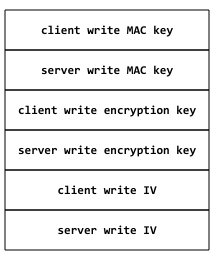

# HTTPS

#### 公开密钥加密(public-key cryptography)

> **Public key cryptography**, or **asymmetric cryptography**, is any cryptographic system that uses pairs of [keys](https://en.wikipedia.org/wiki/Cryptographic_key): *public keys* which may be disseminated widely, and *private keys* which are known only to the owner. This accomplishes two functions: [authentication](https://en.wikipedia.org/wiki/Authentication_protocol), which is when the public key is used to verify that a holder of the paired private key sent the message, and [encryption](https://en.wikipedia.org/wiki/Encryption), whereby only the holder of the paired private key can decrypt the message encrypted with the public key.

又称**非对称加密**（asymmetric cryptography），加密方式通过一对数学相关的密钥（公钥、私钥）组成，用某用户密钥加密后所得的信息，只能用该用户的解密密钥才能解密。

1. 如果加密密钥是公开的，这用于客户给私钥所有者上传加密的数据，这被称作为**公开密钥加密**（狭义）。例如，网络银行的客户发给银行网站的账户操作的加密数据。
2. 如果解密密钥是公开的，用私钥加密的信息，可以用公钥对其解密，用于客户验证持有私钥一方发布的数据或文件是完整准确的，接收者由此可知这条信息确实来自于拥有私钥的某人，这被称作**数字签名**，公钥的形式就是[数字证书](https://zh.wikipedia.org/wiki/%E6%95%B0%E5%AD%97%E8%AF%81%E4%B9%A6)。

> 常见的公钥加密算法有：[RSA](https://zh.wikipedia.org/wiki/RSA%E5%8A%A0%E5%AF%86%E6%BC%94%E7%AE%97%E6%B3%95)、[ElGamal](https://zh.wikipedia.org/w/index.php?title=ElGamal&action=edit&redlink=1)、[背包算法](https://zh.wikipedia.org/w/index.php?title=%E8%83%8C%E5%8C%85%E7%AE%97%E6%B3%95&action=edit&redlink=1)、[Rabin](https://zh.wikipedia.org/w/index.php?title=Rabin&action=edit&redlink=1)（RSA的特例）、[迪菲－赫尔曼密钥交换协议](https://zh.wikipedia.org/wiki/%E8%BF%AA%E8%8F%B2%EF%BC%8D%E8%B5%AB%E5%B0%94%E6%9B%BC%E5%AF%86%E9%92%A5%E4%BA%A4%E6%8D%A2%E5%8D%8F%E8%AE%AE)中的公钥加密算法、[椭圆曲线加密算法](https://zh.wikipedia.org/wiki/%E6%A4%AD%E5%9C%86%E6%9B%B2%E7%BA%BF%E5%8A%A0%E5%AF%86%E7%AE%97%E6%B3%95)（英语：Elliptic Curve Cryptography, ECC）。
>
> 一个完整的密码体系，往往通过公钥加密来创建私有秘钥，然后用私有秘钥通过对称密码学加密大量数据。
>
> [RSA](http://www.ruanyifeng.com/blog/2013/07/rsa_algorithm_part_two.html)

#### SSL/TLS协议

1. client向server索要并验证公钥
2. 双方协商产生“**对话密钥**”（session key）
3. 双方采用“对话密钥”进行加密通信

整个通信阶段，只会在1、2步（握手阶段）使用费对称加密，保证双方用于加密通信的“对话密钥”的安全，之后都使用“对话密钥”进行对称加密，这样既保证了安全性，又避免了公钥加密算法计算量太大消耗太多的时间。

公钥的验证是通过数字证书来进行验证的，只要是数字证书是可靠的，那么公钥就是可靠的，防止公钥被篡改。

**四次握手**

1. ClientHello发送信息包括：
   - 支持的协议版本，比如TLS 1.0版。
   - 一个客户端生成的随机数(random_1)，这个随机数既需要客户端保存又需要发送给服务器。
   - 支持的加密方法，比如RSA公钥加密。
   - 支持的压缩方法。
2. ServerHello发送信息包括：
   - 确认使用的加密通信协议版本，比如TLS 1.0版本。如果浏览器与服务器支持的版本不一致，服务器关闭加密通信。
   - 一个服务器生成的随机数(random_2)。
   - 确认使用的加密方法，比如RSA公钥加密。
   - 服务器证书。
   - 如果服务器需要确认客户端的身份，就会再包含一项请求，要求客户端提供”客户端证书”。比如，金融机构往往只允许认证客户连入自己的网络，就会向正式客户提供USB密钥，里面就包含了一张客户端证书。
3. Client回应步骤
   - 验证服务器证书的合法性，证书合法性包括：证书是否过期，发行服务器证书的 CA 是否可靠，发行者证书的公钥能否正确解开服务器证书的“发行者的数字签名”，服务器证书上的域名是否和服务器的实际域名相匹配。如果合法性验证没有通过，通讯将断开；
   - 客户端使用一些加密算法(例如：RSA,Diffie-Hellman)产生一个48个字节的Key，这个Key叫PreMaster Secret。**该PreMaster Secret用服务器公钥加密传送，防止被窃听**。
   - 编码改变通知，表示随后的信息都将用双方商定的加密方法和密钥发送。
   - 客户端握手结束通知，表示客户端的握手阶段已经结束。这一项同时也是前面发送的所有内容的hash值，用来供服务器校验。
   - 如果前一步，服务器要求客户端证书，客户端会在这一步发送证书及相关信息。
4. Server回应步骤
   - 服务器通过上面的三个随机数(random_1,random_2,PreMaster Secret)，计算出本次会话的『会话密钥(session secret)』，然后向客户端发送下面信息
     - 编码改变通知，表示随后的信息都将用双方商定的加密方法和密钥发送。
     - 服务器握手结束通知，表示服务器的握手阶段已经结束。这一项同时也是前面发送的所有内容的hash值，用来供客户端校验。

至此，服务器和客户端的握手阶段全部结束，接下来，客户端与服务器进入加密通信，就完全是使用普通的HTTP协议，只不过用『会话密钥(session secret)』对内容做对称加密。

**Master secret 说明**

上面握手过程中存在三个Key(random_1,random_2,PreMaster Secret)，而且服务器和客户端都保留着这三个值，客户端和服务端通过这三个值计算出同样的Master secret。Master secret是由系列的hash值组成的，结构如下：

其中，Client/Server write MAC key 是用来对数据进行验证的，Client/Server write encryption Key 是用来对数据进行加解密的会话密钥(session secret)，MAC(Message Authentication Code)，是一个数字签名，用来验证数据的完整性，可以检测到数据是否被串改。。

**数据传输**

在所有的握手阶段都完成之后，就可以开始传送应用数据了。应用数据在传输之前，首先要附加上MAC secret，然后再对这个数据包使用write encryption key进行加密。在服务端收到密文之后，使用Client write encryption key进行解密，客户端收到服务端的数据之后使用Server write encryption key进行解密，然后使用各自的write MAC key对数据的完整性包括是否被串改进行验证。

#### SSL劫持攻击

**HTTPS 替换为 HTTP**

这种方式就是攻击者充当中间人和服务器通信，然后把相应的通信内容通过 HTTP 协议发送给客户端，由于 HTTP 协议是未加密的，于是就可以截获用户的访问数据。

这种攻击方式比较简单，通过代理，可以很容易的把 HTTPS 变成 HTTP，这个一方面需要用户留意网站是否有从 HTTPS 跳转到 HTTP 的行为，另一方面服务器也可以通过配置将所有HTTP的请求强制转移到HTTPS上。

**HTTPS 劫持**

这种方式攻击者为了获得 HTTPS 的明文传输内容，需要充当中间人，替换服务器发给用户的包含公钥的证书。攻击者既和用户之间建立了 HTTPS 链接，又和服务器建立了 HTTPS 链接。

在上面握手建立的过程中，由于用户的公钥是攻击者生成的，所以攻击者可以轻易获得握手中的数据。也就可以获取到和用户通信过程中的对称加密的密钥，攻击者可以通过密钥获取用户发送的数据，同时在使用和服务器通信的密钥加密后再发送给服务器。

这种攻击方式也有一个明显的问题就是攻击者生成的证书几乎是不可能被用户信任的，在这种情况下，用户浏览器通常会提示该网站的证书不可信，是否继续访问，这已经对用户进行了一个明显的警告了。

另外我们也可以通过这种对基于 HTTPS 的通信进行抓包分析。Mac 平台著名的抓包工具 Charles 就是基于这种方式，首先要求你信任一个它的证书，然后自己充当中间人对你与某个服务器的 HTTPS 通信进行抓包分析。

#### 参考链接

http://www.ruanyifeng.com/blog/2014/02/ssl_tls.html

http://honglu.me/2016/01/13/HTTPS%E8%AF%A6%E8%A7%A3/