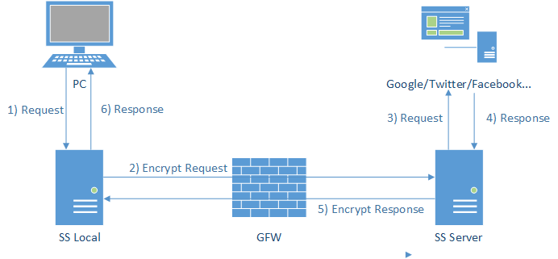

# SSH原理及应用

#### 公钥登陆

所谓"公钥登录"，原理很简单，就是用户将自己的公钥储存在远程主机上。登录的时候，远程主机会向用户发送一段随机字符串，用户用自己的私钥加密后，再发回来。远程主机用事先储存的公钥进行解密，如果成功，就证明用户是可信的，直接允许登录shell，不再要求密码。

远程主机将用户的公钥，保存在登录后的用户主目录的$HOME/.ssh/authorized_keys文件中。

```
// 公钥的保存过程
$ ssh user@host 'mkdir -p .ssh && cat >> .ssh/authorized_keys' < ~/.ssh/id_rsa.pub
```

#### git

git决定使用ssh还是http由.git/config下url配置决定的

#### SCP

scp是secure copy的简写，用于在Linux下进行远程拷贝文件的命令，和它类似的命令有cp，不过cp只是在本机进行拷贝不能跨服务器，而且scp传输是加密的。当你服务器硬盘变为只读 read only system时，用scp可以帮你把文件移出来。

```
scp [参数] [原路径] [目标路径]
```


#### ShadowSocks



1. PC客户端发出请求基于Socks5协议跟SS-Local端进行通讯，由于这个SS-Local一般是本机或路由器等局域网的其他机器，不经过GFW，所以解决GFW通过特征分析进行干扰的问题。
2. SS-Local和SS-Server两端通过多种可选的加密方法进行通讯，经过GFW的时候因为是常规的TCP包，没有明显特征码GFW也无法对通讯数据进行解密，因此通讯放行。
3. SS-Server将收到的加密数据进行解密，还原初始请求，再发送到用户需要访问的服务网站，获取响应原路再返回SS-04，返回途中依然使用了加密，使得流量是普通TCP包，并成功穿过GFW防火墙。

#### 参考链接

http://www.ruanyifeng.com/blog/2011/12/ssh_remote_login.html