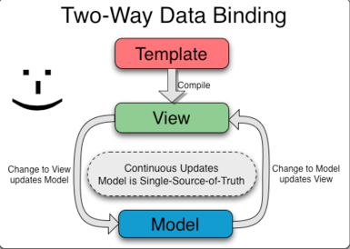

# AngularJs

#### module

AngularJs中的module相当于式一个namespace或者package，表示一堆功能单元的集合。

```javascript
// 定义module，提供两个参数：module名、依赖列表
angular.module("moduleName", ["otherModule"]);
// 使用module（只提供一个参数），为module添加一个controller
angular.module("moduleName")
	.controller("TestController", function(){});
```


#### controller

> In Angular, a Controller is defined by a JavaScript **constructor function** that is used to augment the [Angular Scope](https://docs.angularjs.org/guide/scope).

当一个controller通过 `ng-controller` 绑定到DOM上时，Angular就会通过其**constructor function**实例化一个新的controller对象，同时一个新的scope被创建，并通过参数 `$scope` 的形式注入该controller。这样，该controller通过$scope与view之间进行通信(data and function)，定义一个controller需要提供两个参数：controller name、依赖以及constructor function：

```javascript
// 定义一个controller
angular.module('app')
	.controller('TestController', [$scope, function($scope){}]);
```

可以通过$inject的方式注入依赖：

```javascript
// 定义一个controller
angular.module("moduleName")
	.controller("TestController", TestController);
// 依赖注入
TestController.$inject = ['$scope'];
function TestController($scope){
  // 添加data处理逻辑
  $scope.message = "hello";
  $scope.onClick = function (item){
  		itme.name = "world";
	};
}
```

在HTML中，通过`ng-controller`引用该controller, 则在该HTML区域内，可以使用controller保存的数据。


#### service

复用性代码，存储大多数的逻辑以及重复性数据。由于对应的controller会在每次切换路由或者刷新页面的时候被清理，那么就需要service来帮我们长期存储数据，并在不同的controler之间使用。

**factory**  

**service** 

**provider** 


#### scope

> [Scope](https://docs.angularjs.org/api/ng/type/$rootScope.Scope) is an object that refers to the application model. It is an execution context for [expressions](https://docs.angularjs.org/guide/expression). Scopes are arranged in hierarchical structure which mimic the DOM structure of the application. Scopes can watch expressions and propagate events. Scope is the glue between application controller and the view. 

scope是model到view的数据桥梁。


#### data binding

> Data-binding in Angular apps is the automatic synchronization of data between the model and view components.  First the template (which is the uncompiled HTML along with any additional markup or directives) is compiled on the browser. The compilation step produces a live view. Any changes to the view are immediately reflected in the model, and any changes in the model are propagated to the view. 

**ng-bind**

> [ng-bind](https://docs.angularjs.org/api/ng/directive/ngBind) attribute tells Angular to replace the text content of the specified HTML element with the value of a given expression, and to update the text content when the value of that expression changes.

one-way binding (`$scope -> view`), 可以使用`filter过滤数据，用于更新HTML标签中元素的value;

同样可以使用插值表达式`{{expression}}` , 只是当网速较慢的时候，在网页还没有渲染好的时候，会出现`{{}}`解析符号。

**ng-model**

> [ng-model](https://docs.angularjs.org/api/ng/directive/ngModel) directive binds an `input`,`select`, `textarea` (or custom form control) to a property on the scope using [NgModelController](https://docs.angularjs.org/api/ng/type/ngModel.NgModelController), which is created and exposed by this directive.

不同于ng-bind，ng-model是two-way binding (`$scope -> view and view -> $scope`), view与model之间的双向数据传递，绑定的是form control中的value, 比如下面的代码示例：tableParams.departmentName绑定的是item.name, 即select的value部分具体值。

```html
<div class="input-group" style="margin-right: 10px;">
  <span class="input-group-addon his-input-group-addon">患者科室：</span>       
  <ui-select ng-model="tableParams.departmentName" theme="bootstrap" 
             class="his-medium-small-select"
             reset-search-input="true" 
             on-select="chooseDepartment($item)">
  	<ui-select-match placeholder="患者科室">
    	{{$select.selected.name}}
  	</ui-select-match>
  	<ui-select-choices repeat="item.name as item in departments" refresh-delay="0">
    	<div ng-bind-html="item.name"></div>
  	</ui-select-choices>
  </ui-select>
</div>
```


**数据双向绑定** 

从界面的操作能过实时反映到数据，而数据的变更也能实时的展现到界面。




#### filter

