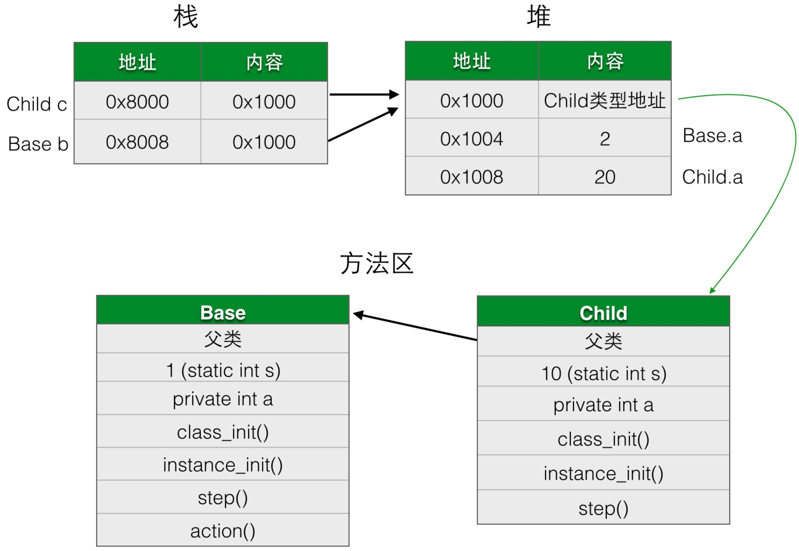
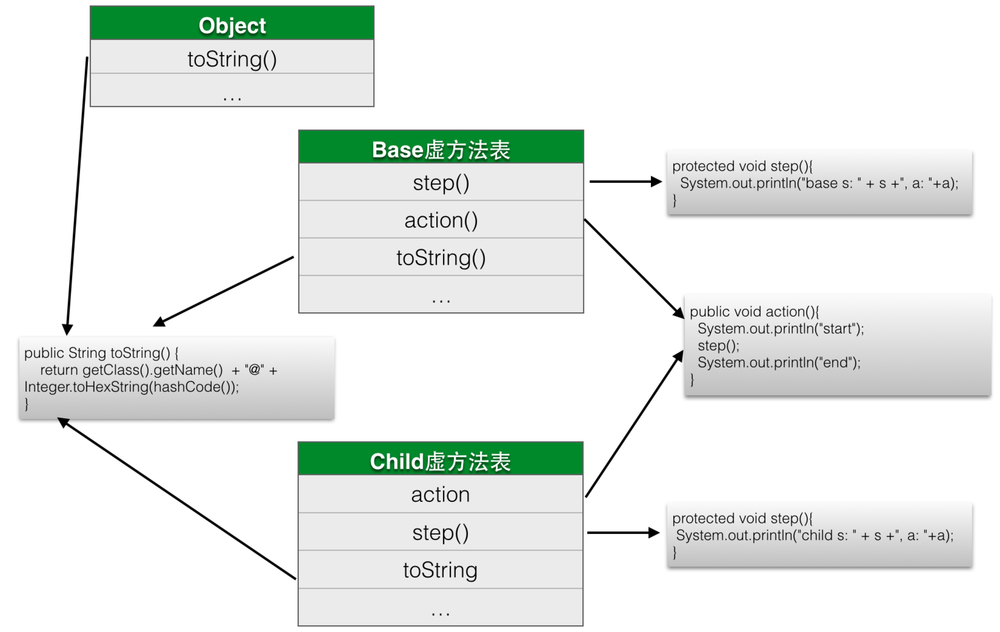

# Basic Notice

**目录**：

- **Pass-by-Value：**Java参数的传递方式，引用？值？


- **Polymorphism:** 有关Java多态的实现机制，动态绑定
- **enumerated:** Java枚举类型特性
- **Wrapper Class & Static Import:** 包装类以及静态导入

***

#### Pass-by-Value

[Java is Pass-by_Value](http://javadude.com/articles/passbyvalue.htm)

[http://ifeve.com/stackoverflow-reference-or-value/](http://ifeve.com/stackoverflow-reference-or-value/)

Java中的所有参数都是值传递的 (call by value)：参数传递本质就是一种 = 操作(赋值操作)

- 基本数据类型：= 操作完整的复制了变量的值；
- 对象引用：= 操作复制了变量的引用，在函数内部没有对该引用重新赋值(即改变引用指向的对象地址)，那么该引用就一直指向的是原对象的内存空间。

```java
// 基本类型
void foo(int value) {
  value = 100;
}
foo(num); // num的值并不会被改变

// 没有提供改变自身方法的对象类型
void foo(String text) {
  text = "new"; // 相当于text = new String("new");
}
foo(str); // str并不会被改变

// 提供了改变自身方法的对象类型
void foo(StringBuilder builder) {
  builder.append("4");
}
foo(sb); // sb会被改变

// 提供了改变自身方法的对象类型，但是使用赋值运算法
void foo(StringBuilder builder) {
  builder = new StringBuilder("new"); // 改变了引用指向的地址
}
foo(sb); // sb并不会被改变
```


#### Polymorphism

> **[继承的本质](http://gold.xitu.io/post/57bd6b11c4c9710061627f05)**

一个类的主要信息包括：

1. 类变量（静态变量）
2. 类初始化代码（静态变量的赋值语句，静态代码块）
3. 类方法（静态方法）
4. 实例变量
5. 实例初始化代码（实例变量初始化语句，实例代码块，构造方法）
6. 实例方法
7. 父类信息引用

一个类的加载过程：

1. 分配内存保存类的信息
2. 给类变量赋默认值
3. 加载父类
4. 设置父子关系
5. 执行初始化代码（先父类，再子类）

类初始化代码在类被装载的时候（第一次使用类的时候）执行，且只执行这一次。实例初始化代码在对象初始化的时候（new）执行，且实例代码块先于构造方法执行。



多态的实现需要的必要元素包括：继承、覆盖、向上转型（父类引用子类对象）; 通过动态绑定（auto binding）机制实现执行正确的方法。在JVM加载类的时候，会在方法区存放很多有关于该类的数据结构，其中一个数据结构即叫做方法表，子类和父类的方法表中相同签名方法的索引项是相同的，这样，在实现动态绑定的时候，先由父类引用的类中寻找调用的方法，找到该方法的索引项，再由**实例化的内存实际对象**的引用找到实际的类的方法表，调用该索引项的方法。

[方法调用](http://blog.csdn.net/xtayfjpk/article/details/41924971)

在Class文件的编译过程中不包含传统编译中的连接步骤，一切方法调用在Class文件里存储的都只是符号引用，而不是方法在实际运行时内存布局中的入口地址(相当于直接引用)。

**方法解析**

方法在程序真正运行之前就有一可确定的调用版本，并且这个方法的调用版本是运行期是不可改变的。换句话说，调用目标在程序代码写好、编译器进行编译时就必须确定下来（静态方法和私有方法）。这类方法的调用称为解析(Resolution)。

**静态分派**

静态分派的最典型应用就是方法重载，虚拟机(准确地说是编译器)在重载时是通过参数的静态类型而不是实际类型作为判定依据的。并且静态类型在编译期是可知的，所以在编译阶段，Javac编译器就根据参数的静态类型决定使用哪个重载版本。

静态分派发生在编译阶段，因此确定静态分派的动力实际上不是由虚拟机来执行的。另外，编译器虽然能确定出方法的重载版本，但是很多情况下，这个重载版本并不是“唯一的”，往往只能确定一个“更适合的”版本。这种模糊的结论在0和1构成的计算机世界中算是个比较“稀罕”的事件，产生这种模糊结论的主要原因是字面量不需要定义，所以字面量没有显式的静态类型，它的静态类型只能通过语言上的规则去理解和推断。

```java
// Man extends Human, Woman extends Human
public class Main {
    public void hello(Human human) {
        System.out.println("human say hello");
    }

    public void hello(Man man) {
        System.out.println("man say hello");
    }

    public void hello(Woman woman) {
        System.out.println("woman say hello");
    }

    public static void main(String[] args) {
        Main main = new Main();

        Human man = new Man();
        Human woman = new Woman();

        main.hello((Man)man);
        main.hello(woman);
    }
}

/**
* result:
*
* man say hello
* human say hello
*/
```


**动态分派**

动态分派与重写(Override)有着很密切的关联。

由于动态分派是非常频繁的动作，而且动态分派的方法版本选择过程需要在运行时在类的方法元数据中搜索合适的目标方法，因此在虚拟机的实际实现中基于性能的考虑，大部分实现都不会真的进行如此频繁的搜索。面对这种情况，最常用的优化手段就是在类的方法区中建立一个虚方法表(Virtual Method Table，也称vtable，与此对应，在invokeinterface执行时也会用到接口方法表，Interface Method Table，也称itable)，使用虚方法表索引来代替元数据据查找以提高性能。

> 所谓虚方法表，就是在类加载的时候，为每个类创建一个表，这个表包括该类的对象所有动态绑定的方法及其地址，包括父类的方法，但一个方法只有一条记录，子类重写了父类方法后只会保留子类的。虚方法表中存放着各个方法的实际入口地址。如果某个方法在子类中没有被重写，那么子类的虚方法表里面的地址入口和父类方法的地址入口是一致的，都指向父类的实现入口。如果子类中重写了这个方法，子类方法表中的地址将会被替换为指向子类实现版本的地址入口。



#### enumerated

Java的枚举是特殊的类，既然是类，则其可以定义自己的成员，为这些枚举指定属性，枚举实例由Java运行时创建，在外部不能实例化，所以添加了成员的枚举的构造函数为私有，同时enum类不应提供set函数;
```java
public enum RegularPolygon{
	// 有参数的枚举最后必须使用分号结束
	TRIANGLE(3), SQUARE(4), PENTAGON(5), HEXAGON(6);

	private Shape shape;

	private RegularPolygon(int sides){
		switch(sides){
			case 3:
				shape = new Triangle(1, 1, 1, 60, 60);
				break;
			case 4:
			...
		}
	}
}
```

#### Wrapper Class & import static

在需要将基本数据类型当作对象进行处理时使用，主要使用在集合以及本类型与其他类型的转换上。
```java
List<Integer> intList = new ArrayList<>();
Integer i = 3;
short shValue = i.shortValue();
int strToint = Integer.getInteger("3");
```
使用关键字import static导入类型中的静态成员，也可以导入枚举类型;
```java
import static java.lang.System.out;
import static climate.temperate.Season.*

public static void main(String... args)
{
	out.println("hello world");
	Seasons s = WINTER;
}
```
```java
package climate.temperate;

enum Seasons {WINTER, SPRING, SUMMER, AUTUMN};
```
