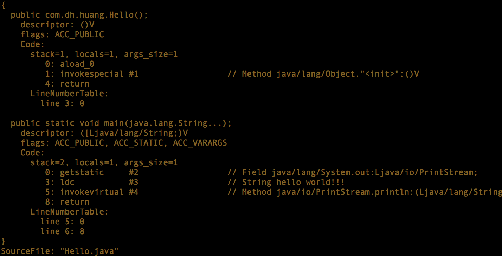

# 类文件结构

> http://www.cnblogs.com/java-zhao/p/5197906.html

实用命令：

```
javac -g TestClass.java
    -g：生成所有的调试信息，包括局部变量名和行号信息。
javap -c TestClass > TCC.txt，对于javap常用的参数：
    -c：输出字节码Code
    -l(小写L)：输出Code、LineNumberTable与LocalVariableTable
    -s：输出方法签名（方法的接收参数列表和返回值）
    -verbose：包含-c、-l以及输出class文件的编译版本，常量池，Stack, Locals, Args_size
对于javap而言，常用的就是-c或-verbose　　
```

#### package

> the package name is part of the class and cannot be modified

java全限定类名：包名+类名(com.dh.huang.hello)，以及[class load](./class load.md)相关原因



所以指定程序入口时，classPath必须是顶层package所在的目录，class应是其全限定类名，否则main class not found...

> Java classes are organized into packages that are mapped to directories in the file system. But, unlike the file system, whenever you specify a package name, you specify the whole package name and never part of it. For example, the package name for `java.awt.Button` is always specified as `java.awt`.
> 
> For example, suppose you want the Java JRE to find a class named Cool.class in the package utility.myapp. If the path to that directory is `C:\java\MyClasses\utility\myapp`, then you would set the class path so that it contains `C:\java\MyClasses`. To run that application, you could use the following `java` command:
> 
> ```
> java -classpath C:\java\MyClasses utility.myapp.Cool
> ```
> 
> The entire package name is specified in the command. It is not possible, for example, to set the class path so it contains `C:\java\MyClasses\utility` and use the command java `myapp.Coo`l. The class would not be found.
