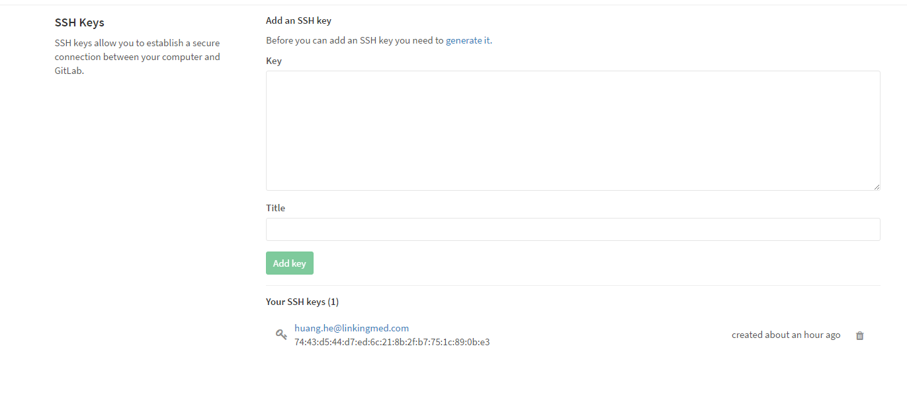

# Gitlab


Install
=======

- 安装环境：Centos 7
- Gitlab版本：[Gitlab Community Edition(CE) Omnibus package](https://about.gitlab.com/downloads/#centos7)，镜像地址改为：[清华大学TUNA镜像源](https://mirror.tuna.tsinghua.edu.cn/help/gitlab-ce/)
- 使用邮件服务器：Postfix

更改镜像地址：新建/etc/yum.repos.d/gitlab-ce.repo
```
[gitlab-ce]
name=gitlab-ce
baseurl=http://mirrors.tuna.tsinghua.edu.cn/gitlab-ce/yum/el7
repo_gpgcheck=0
gpgcheck=0
enabled=1
gpgkey=https://packages.gitlab.com/gpg.key
```
接着执行：
```
yum makecache
yum install gitlab-ce
```

安装完毕，修改配置文件(/etc/gitlab/gitlab.rb)，设置url地址：
```
## Url on which GitLab will be reachable.
## For more details on configuring external_url see:
## https://gitlab.com/gitlab-org/omnibus-gitlab/blob/master/doc/settings/configuration.md#configuring-the-external-url-for-gitlab
external_url 'http://101.201.81.25'
```
接着执行：gtilab-ctl reconfigure

访问该url，如果出现502错误，一般是unicorn服务未成功启动，其默认端口号为8080，有可能与其他服务端口号冲突，可在配置文件中进行修改(使用gitlab-ctl tail unicorn跟踪unicorn服务的状态)：
```
## Advanced settings
# unicorn['listen'] = '127.0.0.1'
unicorn['port'] = 9090
# unicorn['socket'] = '/var/opt/gitlab/gitlab-rails/sockets/gitlab.socket'
# unicorn['pidfile'] = '/opt/gitlab/var/unicorn/unicorn.pid'
# unicorn['tcp_nopush'] = true
# unicorn['backlog_socket'] = 1024
# Make sure somaxconn is equal or higher then backlog_socket
# unicorn['somaxconn'] = 1024
# We do not recommend changing this setting
# unicorn['log_directory'] = "/var/log/gitlab/unicorn"
```
接着执行：gitlab-ctl reconfigure

头像无法显示问题，修改配置文件(/etc/gitlab/gtilab.rb)：
```
# gitlab_rails['gravatar_plain_url'] = 'http://gravatar.com/avatar/%{hash}?s=%{size}&d=identicon'
gitlab_rails['gravatar_plain_url'] = 'http://cn.gravatar.com/avatar/%{hash}?s=%{size}&d=identicon'
```
接着执行：
```
gitlab-ctl reconfigure
gitlab-rake cache:clear RAILS_ENV=production
```


使用
====

使用SSH与服务器进行通信，客户端需要生成SSH key，并将公钥在服务器端进行配置，windows生成SSH key可以直接使用git自带的SSH生成:
```
ssh-keygen -t rsa -C "your git name"
```
结果大致如下：
```
Generating public/private rsa key pair.
Enter file in which to save the key (C:/Users/username/.ssh/id_rsa):
Enter passphrase (empty for no passphrase):
Enter same passphrase again:
Your identification has been saved in C:/Users/username/.ssh/id_rsa.
Your public key has been saved in C:/Users/username/.ssh/id_rsa.pub.
```
默认生成的SSH key是保存在用户目录下的.ssh中，包括id_rsa以及id_rsa.pub，其中id_rsa.pub是公钥，将其拷贝到服务器上即可，可参考[git-ssh 配置和使用](https://segmentfault.com/a/1190000002645623)。

