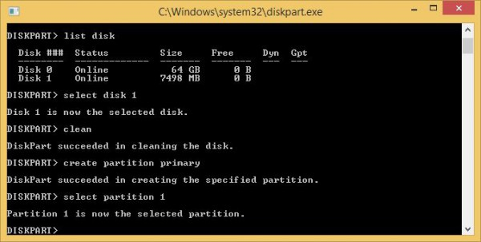
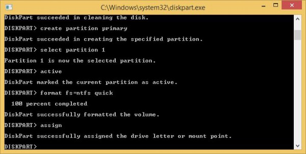
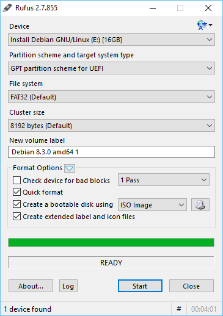

# Win USB bootable

介绍比较方便的windows usb启动盘的制作方法以及工具。

- 打开cmd, 输入dispart，打开磁盘管理工具
- 使用listdisk查看磁盘信息，使用select disk X选择对应的usb
- 使用clean 清空磁盘，create partition primary建立分区信息
- 输入active激活分区，format fs=ntfs quick格式化分区
- 输入assign注册usb分区信息
- 再将ISO解压后的数据文件拷入usb中即可，至此启动盘制作完毕

如果觉得上述步骤太繁琐，可以使用[rufus](https://rufus.akeo.ie/)工具.
