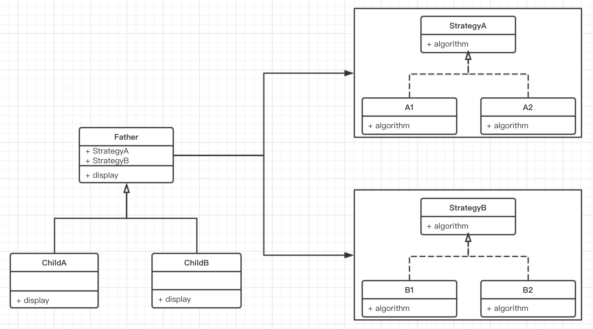

# 设计模式

**原则一：**

> 找出应用中可能需要变化之处，把他们独立出来，不要和哪些不需要变化的代码混合在一起，即**封装变化**

当需求变化或者增加时，我们需要在对既有代码影响最小的情况下，同时花费较小的时间重做代码。即在代码最大程度的复用情况下，更加方便的增加新功能。

**原则二：**

> 针对于接口编程，而不是针对于实现编程

简单来说，针对于接口编程就是多态性的体现，通过一个接口来调用一个类及其方法，而不是直接建立一个类的实体来调用类。

**原则三：**

> 多用组合(composition)，少用继承

子类的算法并不是通过继承而来，而是通过和适当的算法组合而来，这样子类可以展现的行为就不会受到父类的限制，可以比父类多或者少。父类持有算法接口，子类决定具体的算法接口实现。

**但是父类就必须持有各种算法接口？？？**

#### 策略模式(Strategy Pattern)

> 定义了算法簇，分别封装起来，并让他们之间可以互相替换，让算法的实现独立于使用算法的用户

**why**

1. 完成一项功能，通常会有很多种不同的方式（不同的途径），这些方式是有可能会经常变化的，会根据不同的条件（**状态**）选择不同的方式来使用，简单的做法就是通过if…else…的方式来实现，这样的话不可避免的会导致扩展与修改的麻烦

   like this

   ```java
   
   ```

   better way

   ```java
   
   ```

2. 一个超类的各个子类的各种行为方式，如果通过继承或者实现的方式，那么在扩展的时候，就得去检查每个子类的实现；如果将行为单独封装，子类再去**组合**这些行为，那么将方便很多

   like this

   ```java
   
   ```

   better way

   ```java
   
   ```

**how**

对象的行为也可以称为算法，也可以称为策略(strategy)。策略模式简单来说就是替代通过if…else…的方式来决定使用何种算法实现我们的功能。为了保证我们实现的多个策略的一致性，一般会使用一个抽象的策略类来做算法的具体定义，而每一个策略类则对应一种具体的算法。策略模式是一种**对象行为模式** 。



- 策略模式是对算法的封装，它把算法的责任和算法本身分割开，委派给不同的对象管理。策略模式通常把一个系列的算法封装到一系列的策略类里面，作为一个抽象策略类的子类。用一句话来说，就是**准备一组算法，并将每一个算法封装起来，使得它们可以互换** ；
- 策略模式中，由使用者自己决定在什么情况下使用什么具体策略角色；
- 策略模式仅仅封装算法，提供新算法插入到已有应用中，以及老算法从应用中“退休”的方便，策略模式并不决定在何时使用何种算法；
- 通过**组合**的方式，动态的设定对象的行为，相比与硬编码在一个类中，代码结构更加清晰，维护也相对简单；

**策略模式的缺点**

- 用户必须知道所有的策略类，并自行决定使用哪一个策略类；
- 策略模式将造成产生很多策略类，可以通过使用**享元模式**在一定程度上减少对象的数量；


**原则四：**

> 使交互对象间尽可能的松耦合

####观察者模式(Observer Pattern)